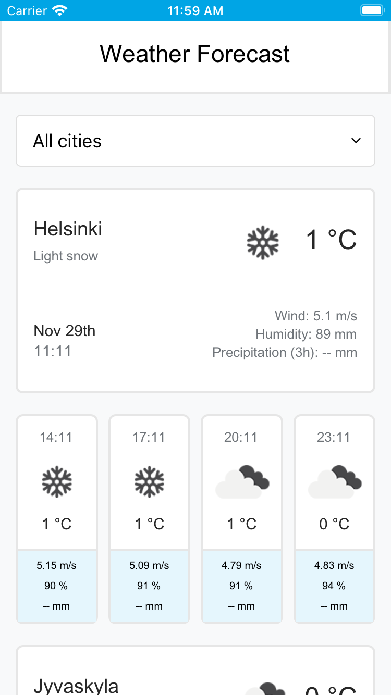

# rn-weather-app

- download or clone this project
- in config folder, create api_key.js file:
```
// config/api_key.js
export const API_KEY = 'your API KEY goes here';
```
- run **yarn install** in a command line

